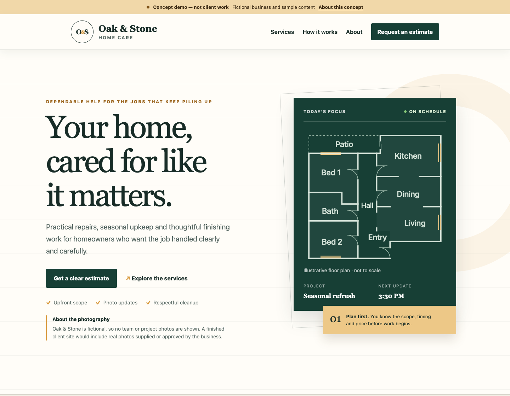
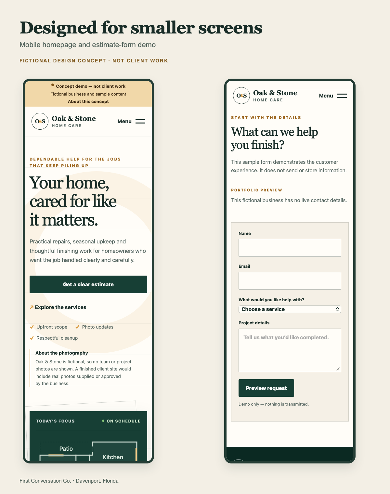

# Oak & Stone — responsive website concept

A fictional home-services website portfolio sample by Ryan Burton, First Conversation Co., Davenport, Florida. It is not client work or an operating home-services business.

The goal was to make a small business easy to understand on a desktop, tablet or phone: clear services, a readable page structure and an obvious next step without crowding the layout.

## Preview





The mobile pair is arranged for presentation. Both views are rendered from this export, not from a live client website.

## What is included

- Semantic HTML, custom CSS and small vanilla JavaScript interactions; no framework or build step.
- Responsive service cards, fluid typography and separate phone navigation.
- A labeled menu with expanded-state updates, link dismissal and Escape-key dismissal.
- A skip link, visible keyboard focus, labeled form controls and a live status message.
- An original illustrative SVG house plan; it is fictional and not to scale.
- Reduced-motion and increased-contrast preferences.

## Run locally

Open `index.html` in a browser. All assets are included locally. No installation, account or server is required.

With Node.js installed, run the source checks:

```sh
node --test tests/source.test.mjs
```

## Demonstration boundaries

The estimate form is a front-end interaction only. It does not send, store or process requests, take payments or connect to a CRM. Its controls are disabled until the local-only JavaScript handler is installed, so the preview fails closed when JavaScript is unavailable. Do not enter real personal information. A production form would require its own secure implementation and testing.

This separate portfolio export intentionally omits phone numbers, email addresses and external contact links. The separate live business websites retain their contact details. No client source, private project records, credentials, analytics or historic Git objects are included.

There are no business/team/project photographs because this is a fictional concept. A completed client site would use real business-supplied or approved photographs.

## QA scope

The contact-free export was checked in isolated WebKit at widths 320, 375, 600, 768, 900, 901, 1024 and 1440 pixels. Checks cover horizontal overflow, internal destinations, menu behavior, native required-field validation and the local form preview, plus the disabled fallback with JavaScript turned off. This is not a claim of accessibility certification or exhaustive cross-browser/device coverage.

Copyright 2026 First Conversation Co. No separate open-source license is granted with this portfolio sample.
